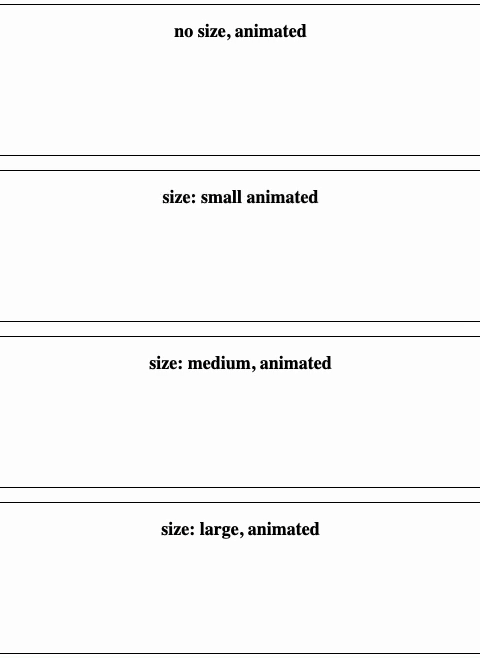
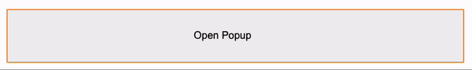

# react-animations
custom react toast animations with different variants/animations
Minimalistic elements meant to be stylized and placed within your project


## Popup
position is meant to pop up not be inline with other components or containers



```
<Popup show={show} animated={true} onClose={closed}/>
```

### Props
|prop| type | comment|
|----|------|--------|
|show|bool| true = popup opens|
|animated|bool|If popup is animated|
|onClose|callback|called when popup is closed|
|variant|string | success(default), warning, danger, trash|

## InLinePopup
position is meant to fit within buttons, cards, and other containers


```
<InLinePopup show={show} animated={true} onClose={closed}/>
```
### Props
|prop| type | comment|
|----|------|--------|
|show|bool| true = popup opens|
|animated|bool|If popup is animated|
|onClose|callback|called when popup is closed|
|variant|string | success(default), warning, danger, trash|

# Environment Setup
## Demo
```
git clone https://github.com/jaysongiroux/react-animations.git
cd react-animations/react-animations
npm install
npm start
```
## Building
```
git clone https://github.com/jaysongiroux/react-animations.git
cd react-animations/react-animations
npm run build or yarn build
```
## deploy
```
yarn build or npm run build
npm deploy
```